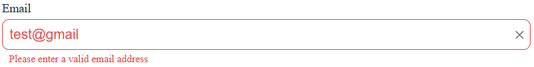
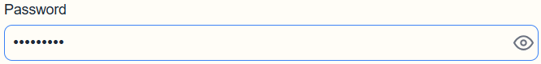
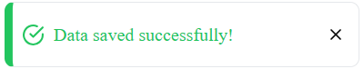
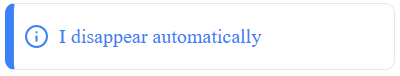
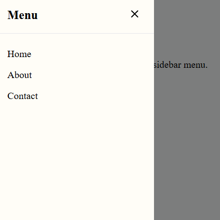

# React UI Component Library

This repository contains a reusable UI component library built as part of a technical assessment for the Front-end JS Engineer role. The project demonstrates the implementation of interactive components using **React**, **TypeScript**, and **Storybook**.

## Tech Stack

- **Core:** React, TypeScript, Vite
- **Styling:** SCSS Modules
- **Linting:** ESLint + Prettier

## Getting Started

Follow these steps to run the project locally.

### Prerequisites

Make sure you have **Node.js** (v16+) installed.

### Installation

1.  Clone the repository:

    ```bash
    git clone [https://github.com/your-username/your-repo-name.git](https://github.com/your-username/your-repo-name.git)
    cd your-repo-name
    ```

2.  Install dependencies:
    ```bash
    npm install
    # or
    yarn install
    ```

### Running Storybook (Recommended)

To view the components in isolation with their documentation and controls:

```bash
npm run storybook
```

## Component Overview

### 1. Input Component (`<Input />`)

A versatile input field that handles text, passwords, and numbers with built-in validation states.

**Features:**

- **Password Toggle:** Automatically adds a show/hide button for `type="password"`.
- **Clearable:** Optional clear button to reset the field.
- **States:** Supports `error` and `disabled` states with visual feedback.

**Usage:**

```tsx
import { Input } from "./components/Input/Input";

<Input
  label="Password"
  type="password"
  placeholder="Enter secure password"
  clearable
  error={hasError ? "Password is too short" : undefined}
  onChange={(e) => console.log(e.target.value)}
/>;
```

### 2. Toast Component (`<Toast />`)

A notification component designed to provide feedback without blocking user interaction.

**Features:**

- **Variants:** 4 semantic types: success, error, warning, info
- **Auto-dismiss:** Automatically disappears after a specified duration.
- **Animation:** Smooth CSS-based slide-in and slide-out transitions.
- **Interactive:** Can be dismissed manually via a close button.

**Usage:**

```tsx
import { Toast } from "./components/Toast/Toast";

{
  showToast && (
    <Toast
      type="success"
      message="Data saved successfully!"
      duration={3000}
      onClose={() => setShowToast(false)}
    />
  );
}
```

### 3. Sidebar Menu (`<Sidebar />`)

A recursive navigation menu that supports infinite nesting levels.

**Features:**

- **Recursive Rendering:** Handles unlimited levels of nested submenus.
- **Smooth Animation:** Uses CSS Grid transition for smooth height expansion (accordion effect).
- **Overlay:** Includes a backdrop that closes the menu when clicked.

**Usage:**

```tsx
import { Sidebar, type MenuItem } from "./components/SidebarMenu/SidebarMenu";

const items: MenuItem[] = [
  { id: "1", label: "Dashboard", icon: "🏠" },
  {
    id: "2",
    label: "Settings",
    children: [{ id: "2-1", label: "Profile" }],
  },
];

<Sidebar
  isOpen={isSidebarOpen}
  onClose={() => setIsSidebarOpen(false)}
  items={items}
/>;
```

## Screenshots

### Input Component States

|               Error Validation               |                Password Toggle Mode                |
| :------------------------------------------: | :------------------------------------------------: |
|  |  |

### Toast Component Variants

|                 Success (With Close Button)                  |                 Info (Auto-dismiss only)                  |
| :----------------------------------------------------------: | :-------------------------------------------------------: |
|  |  |

### Sidebar Menu States

|                   Default Sidebar                    |                     With Icons & Nested Submenus                      |
| :--------------------------------------------------: | :-------------------------------------------------------------------: |
|  |  |
